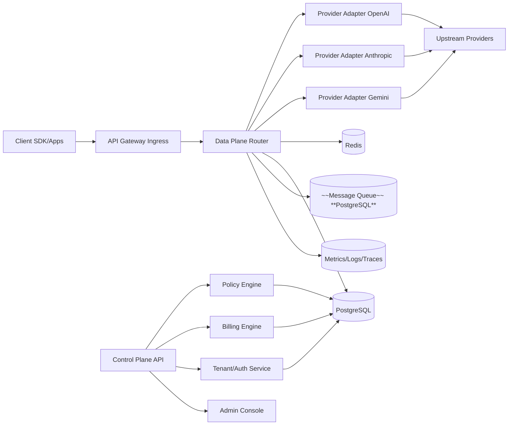

# 商用 LLM 通用转发网关技术蓝图（v1）

- 阶段备注：本文件为阶段性技术草案，需在 `PRD v0` 与产品路线图评审通过后，再进入正式技术评审与实现排期。
- 版本：v1.0
- 日期：2026-03-16
- 适用阶段：0 到 1 立项与首版工程落地
- 目标读者：CTO、架构师、后端负责人、平台工程团队

## 1. 产品目标与范围

## 1.1 产品目标

构建一个可商用的多模型网关平台，向企业与开发者提供：

1. 统一接入：屏蔽上游 LLM 厂商差异，统一 OpenAI/Anthropic/Gemini 入口。
2. 智能路由：基于成本、质量、延迟、配额、可用性做实时调度。
3. 治理与合规：多租户权限、预算控制、审计留痕、策略管控。
4. 成本可控：预扣+结算+退款的可对账计费链路，支持 FinOps 分析。

## 1.2 明确不做（v1）

1. 不做模型训练和微调托管平台。
2. 不做复杂 Agent 编排引擎（只做网关层能力）。
3. 不做全行业模板市场（先聚焦平台能力和企业接入）。

## 2. 目标客户与核心场景

## 2.1 目标客户

1. 有多模型调用需求的 B 端 SaaS 厂商。
2. 有合规与审计要求的中大型企业内部平台团队。
3. 需要统一计费与预算管理的 AI 应用开发团队。

## 2.2 核心场景

1. 多供应商故障切换：主模型失败自动回退，保障 SLA。
2. 成本优化路由：在质量阈值内优先低成本模型。
3. 多租户预算治理：团队/项目/API Key 级预算、限流、告警。
4. 运营可视化：按租户、模型、供应商查看成本与成功率。

## 3. 非功能性指标（必须）

1. 可用性：核心转发 API 月可用性 >= 99.95%。
2. 时延：网关额外开销 P95 <= 60ms（不含上游模型推理时间）。
3. 并发：单集群稳态支持 5k 并发请求（可横向扩展）。
4. 数据一致性：计费账实差异率 <= 0.1%。
5. 可追踪性：100% 请求可关联 request_id 与审计日志。

## 4. 总体架构

采用“控制面（Control Plane）+ 数据面（Data Plane）”双平面架构。

## 4.1 数据面职责

1. 北向协议解析与标准化。
2. 路由决策与重试/回退。
3. 上游适配、流式转发、超时与熔断控制。
4. 请求级计费事件写入与异步落库。

## 4.2 控制面职责

1. 租户、团队、Key、角色权限管理。
2. 策略配置（路由、限流、模型白名单、预算）。
3. 账单与结算、对账、报表。
4. 运维后台（告警、审计、配置发布）。

## 5. 核心模块设计

## 5.1 协议接入层（Northbound API）

v1 支持：

1. OpenAI 兼容：`/v1/chat/completions`、`/v1/embeddings`、`/v1/models`。
2. Anthropic 兼容：`/v1/messages`。
3. Gemini 兼容：`/v1beta/models/*`（优先核心生成路径）。
4. Realtime：先灰度，仅在 OpenAI 兼容路径上线。

设计要求：

1. 每个请求必须注入全局 `request_id`。
2. 统一请求上下文结构（tenant_id/team_id/key_id/model_group）。
3. 统一错误码体系，向上兼容 OpenAI 风格。

## 5.2 路由引擎（Router Core）

路由采用“三阶段过滤 + 多因子打分”：

1. 硬过滤：模型支持、租户策略、预算可用、健康状态。
2. 软排序：分值 = `w1*cost + w2*latency + w3*success_rate + w4*load + w5*quality`。
3. 选择策略：TopK + 加权随机，避免单节点长期垄断。

失败处理链路：

1. 同供应商重试（指数退避，限定最大重试次数）。
2. 跨供应商回退（按策略优先级）。
3. 熔断器打开后跳过异常线路，半开探活恢复。

## 5.3 Provider Adapter 层

每个 Provider Adapter 对外统一接口：

1. `prepare_request()`
2. `send()`
3. `normalize_response()`
4. `normalize_error()`
5. `extract_usage()`

保证点：

1. 上游差异只在 Adapter 内部消化。
2. 统一输出 usage（prompt/completion/total tokens、model、provider）。

## 5.4 计费与账务引擎（Billing Ledger）

采用“预扣-结算-退款”三段式：

1. 预扣：请求入站后按估算额度冻结。
2. 结算：响应完成按真实 usage 结算差额。
3. 退款：失败或中断按规则退还。

关键要求：

1. 所有账务事件必须带幂等键（`request_id + stage`）。
2. 账务流水不可变（append-only ledger）。
3. 支持异步补偿任务与对账任务。

## 5.5 租户权限与安全（Auth + Governance）

1. 多租户隔离：租户 > 团队 > Key > 用户。
2. RBAC：管理员、计费管理员、开发者、只读审计。
3. Key 策略：过期、IP 白名单、模型白名单、速率限制。
4. 数据安全：敏感字段加密存储，日志脱敏。

## 5.6 可观测与运维（Observability）

1. Metrics：QPS、成功率、P95/P99、错误码分布、每模型成本。
2. Logs：结构化日志，统一 request_id 贯穿。
3. Traces：跨服务链路追踪，定位路由与上游瓶颈。
4. 告警：错误率、延迟突增、预算超限、上游可用性下降。

## 6. 数据模型（v1 最小集）

建议存储：PostgreSQL + Redis + 对象存储（导出报表）

核心表：

1. `tenants`：租户基础信息、套餐、状态。
2. `teams`：团队与租户映射、预算策略。
3. `users`：账号主体、角色、状态。
4. `api_keys`：Key、权限、限流、过期策略。
5. `providers`：供应商元数据（OpenAI/Anthropic/Gemini...）。
6. `provider_accounts`：上游账号、凭证、并发、优先级、健康状态。
7. `model_catalog`：模型映射、上下文、价格快照、能力标签。
8. `routing_policies`：路由规则、回退链、权重配置。
9. `requests`：请求索引（request_id、租户、模型、状态、时延）。
10. `usage_events`：usage 明细（token、成本、provider、model）。
11. `billing_ledger`：账务流水（pre/settle/refund）。
12. `budgets`：租户/团队/Key 预算与周期窗口。
13. `audit_logs`：配置变更与敏感操作审计。

Redis 用途：

1. 热路径限流计数（RPM/TPM）。
2. 路由短期状态（负载、错误率、熔断状态）。
3. 幂等键与去重锁。

## 7. API 设计（对外与控制面）

## 7.1 数据面 API（对业务方）

1. `POST /v1/chat/completions`
2. `POST /v1/embeddings`
3. `GET /v1/models`
4. `POST /v1/messages`
5. `POST /v1beta/models/{model}:{action}`

统一响应头：

1. `x-request-id`
2. `x-provider`
3. `x-upstream-model`
4. `x-route-policy`
5. `x-billing-estimate`（可选）

## 7.2 控制面 API（后台与自动化）

1. 租户与团队：`/admin/tenants/*`、`/admin/teams/*`
2. Key 管理：`/admin/keys/*`
3. 路由策略：`/admin/routing/policies/*`
4. 预算策略：`/admin/budgets/*`
5. 账务查询：`/admin/billing/*`
6. 审计查询：`/admin/audits/*`

## 8. 技术栈建议（面向商用）

后端建议：

1. 语言：Go（数据面）+ Go/Java（控制面可同构）。
2. 框架：Gin/Fiber（数据面高性能）+ 标准化中间件。
3. 数据库：PostgreSQL（主存储）+ Redis（状态缓存）。
4. 队列：~~Kafka 或 NATS~~ **未使用**（单体架构，PostgreSQL Outbox 替代）。
5. 可观测：Prometheus + Loki + Tempo 或 ELK + Jaeger。

部署建议：

1. K8s 部署，数据面无状态横向扩展。
2. 控制面与数据面独立扩缩容策略。
3. 灰度发布与回滚（Canary + Feature Flag）。

## 9. 90 天周级落地计划

## 阶段 1（W1-W4）：可用 MVP

1. W1：项目骨架、统一上下文、请求链路与错误码标准化。
2. W2：OpenAI 兼容核心接口 + 两个上游 Adapter。
3. W3：基础路由（健康检查 + 重试 + 回退）+ Redis 限流。
4. W4：预扣/结算最小账务闭环 + 基础监控看板。

里程碑：

1. 单租户端到端可用。
2. 支持最小商用 PoC。

## 阶段 2（W5-W8）：企业治理能力

1. W5：多租户、团队、Key 与 RBAC。
2. W6：预算策略（租户/团队/Key）与超限拦截。
3. W7：路由评分引擎 v1（cost/latency/success/load）。
4. W8：审计日志、告警规则、运营后台基础页。

里程碑：

1. 支持真实客户灰度。
2. 可输出成本归因报表。

## 阶段 3（W9-W12）：稳定性与商业化增强

1. W9：熔断半开与自动恢复、故障演练体系。
2. W10：账务对账任务、补偿任务、异常工单闭环。
3. W11：控制面 API 对接企业内部系统（Webhook/报表导出）。
4. W12：性能压测、SLA 验收、上线手册与值班手册。

里程碑：

1. 首个企业客户可生产试运行。
2. 具备可销售的企业版能力说明。

## 10. 与开源竞品的“借鉴/自研”边界

建议原则：

1. 借鉴架构思路，不直接耦合高法律风险组件到核心路径。
2. 核心账务、租户、策略、审计建议自研，确保可控。

建议映射：

1. 路由策略设计：可借鉴 `litellm`。
2. 调度中台化与运行时反馈：可借鉴 `sub2api`。
3. 快速协议覆盖清单：可参考 `new-api` 路由组织。
4. 入门与兼容思路：可参考 `one-api`。

## 11. 风险清单与应对

1. 法律风险（License 不兼容）  
应对：核心链路只使用 MIT/Apache 友好组件，法务前置审查。

2. 账务风险（多重试导致对账偏差）  
应对：幂等账本 + 日对账 + 异常自动补偿。

3. 性能风险（策略过重影响网关时延）  
应对：策略分层，热路径仅保留 O(1)/O(logN) 逻辑。

4. 运维风险（上游大面积故障）  
应对：多供应商冗余 + 熔断 + 降级模板 + 演练机制。

## 12. 立项验收标准（Go/No-Go）

上线前必须全部满足：

1. 连续 7 天灰度环境可用性 >= 99.9%。
2. 账务差错率 <= 0.1%，且可追溯。
3. 单租户压测达到目标并发阈值。
4. 审计日志覆盖 100% 管理操作。
5. 至少 1 家试点客户完成可用性验收。

---

## 13. 下一步执行建议（立即）

1. 一周内冻结 v1 领域模型与 API 契约（避免边做边漂移）。
2. 两周内完成 W1-W2 的可运行最小链路（先连通再优化）。
3. 并行建立“账务正确性测试集”和“故障演练脚本”，从第一天就纳入 CI。
