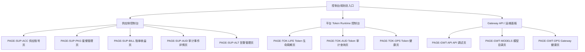
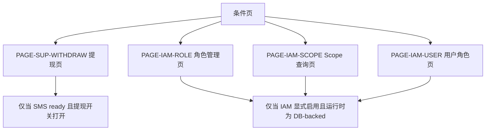
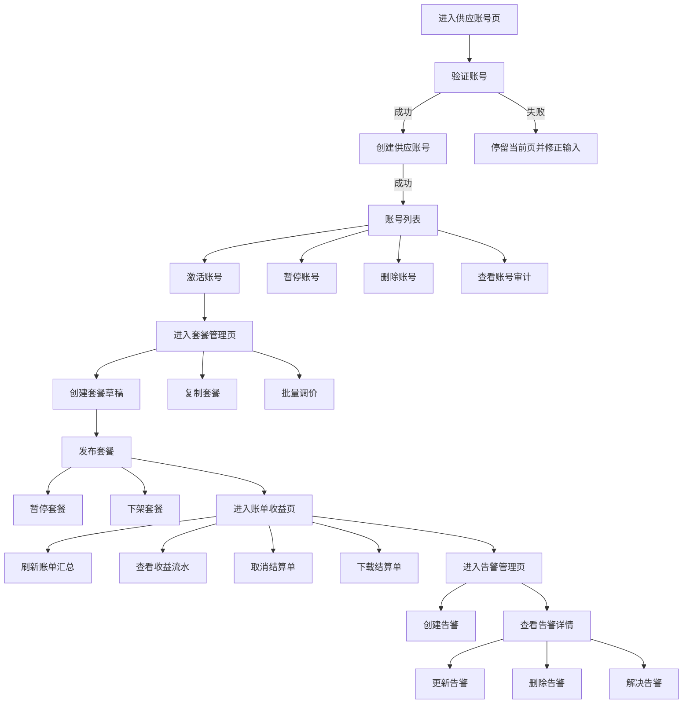
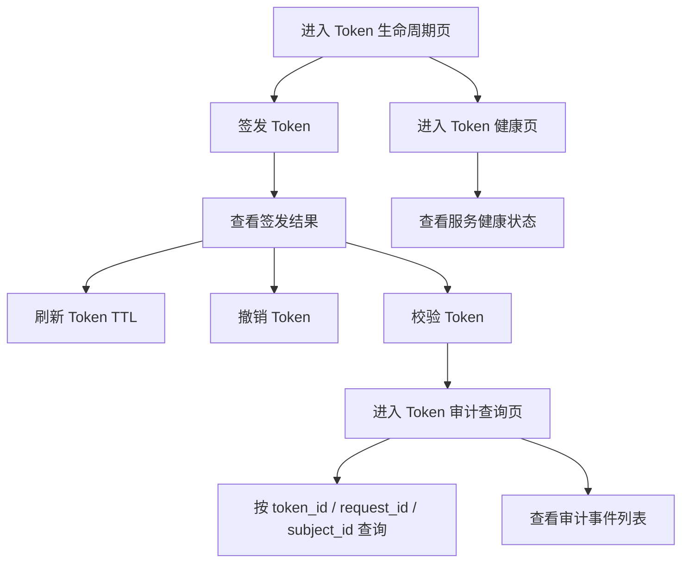
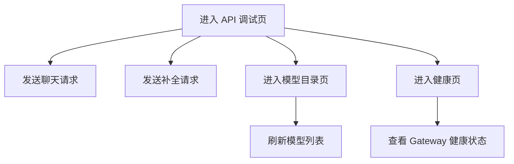

# 页面流程树与按钮矩阵（基于已完成功能）

- 版本：v1.0
- 日期：2026-04-17
- 基础来源：`docs/product/completed_feature_inventory_v1_2026-04-17.md`
- 文档定位：把已完成的后端原子动作串成可用于控制台规划的页面树、按钮矩阵和业务流程图。

## 1. 使用说明

1. 本文不是“当前前端交付物清单”，而是“基于已完成功能反推的控制台规划稿”。
2. 当前仓库没有一方前端控制台，所以本文中的页面名、按钮文案、抽屉名、详情页名都属于建议命名。
3. 只有默认挂载的能力进入“默认页面树”。已实现但默认关闭的能力进入“条件页”。
4. 每个按钮或触发器都尽量只映射一个后端原子动作，方便后续做页面、埋点、测试和验收。

## 2. 总体页面树

### 2.1 默认页面树

### 2.2 条件页

### 2.3 页面清单总表

| 页面ID | 页面名 | 页面类型 | 当前归类 | 主要目标 | 主要数据来源 |
|---|---|---|---|---|---|
| PAGE-SUP-ACC | 供应账号页 | 业务页 | 默认页 | 验证、创建、激活、暂停、删除供应账号 | `supply-api /accounts*` |
| PAGE-SUP-PKG | 套餐管理页 | 业务页 | 默认页 | 创建草稿、发布、暂停、下架、复制、批量调价 | `supply-api /packages*` |
| PAGE-SUP-BILL | 账单收益页 | 业务页 | 默认页 | 查看账单汇总、收益流水、结算单操作 | `supply-api /billing`、`/earnings`、`/settlements/*` |
| PAGE-SUP-AUD | 审计事件详情页 | 详情页 | 默认页 | 查看单条审计事件详情 | `supply-api /audit/events/{id}` |
| PAGE-SUP-ALT | 告警管理页 | 管理页 | 默认页 | 告警 CRUD 与解决闭环 | `supply-api /audit/alerts*` |
| PAGE-TOK-LIFE | Token 生命周期页 | 平台页 | 默认页 | 签发、刷新、撤销、校验 token | `platform-token-runtime /tokens/*` |
| PAGE-TOK-AUD | Token 审计查询页 | 平台页 | 默认页 | 查询 token 审计事件 | `platform-token-runtime /tokens/audit-events` |
| PAGE-TOK-OPS | Token 健康页 | 运维页 | 默认页 | 查看 token runtime 健康状态 | `platform-token-runtime /actuator/health` |
| PAGE-GWT-API | API 调试页 | API 页 | 默认页 | 调试聊天和补全接口 | `gateway /chat/completions`、`/completions` |
| PAGE-GWT-MODELS | 模型目录页 | 目录页 | 默认页 | 查看已注册 provider 模型列表 | `gateway /v1/models` |
| PAGE-GWT-OPS | Gateway 健康页 | 运维页 | 默认页 | 查看网关健康状态 | `gateway /health*` |
| PAGE-SUP-WITHDRAW | 提现页 | 业务页 | 条件页 | 发起提现 | `supply-api /settlements/withdraw` |
| PAGE-IAM-ROLE | 角色管理页 | 平台页 | 条件页 | 角色 CRUD | `supply-api /iam/roles*` |
| PAGE-IAM-SCOPE | Scope 查询页 | 平台页 | 条件页 | scope 列表与权限检查 | `supply-api /iam/scopes`、`/iam/check-scope` |
| PAGE-IAM-USER | 用户角色页 | 平台页 | 条件页 | 查看、分配、撤销用户角色 | `supply-api /iam/users/*/roles*` |

## 3. 供应侧页面流程树

### 3.1 供应侧主流程图

### 3.2 供应侧页面树

1. `PAGE-SUP-ACC 供应账号页`
2. `PAGE-SUP-PKG 套餐管理页`
3. `PAGE-SUP-BILL 账单收益页`
4. `PAGE-SUP-AUD 审计事件详情页`
5. `PAGE-SUP-ALT 告警管理页`
6. `PAGE-SUP-WITHDRAW 提现页`
说明：条件页，默认不进入首批页面范围。

### 3.3 供应侧按钮矩阵

| 页面ID | 建议区域 | 触发方式 | 按钮ID | 建议按钮文案 | 映射原子动作 | 后端接口 | 成功后的页面动作 | 当前归类 |
|---|---|---|---|---|---|---|---|---|
| PAGE-SUP-ACC | 表单区 | 主按钮 | BTN-SUP-ACC-VERIFY | 验证账号 | `SUP-ACC-001` | `POST /api/v1/supply/accounts/verify` | 展示验证结果卡片 | 默认 |
| PAGE-SUP-ACC | 表单区 | 主按钮 | BTN-SUP-ACC-CREATE | 创建账号 | `SUP-ACC-002` | `POST /api/v1/supply/accounts` | 刷新账号列表并回到详情状态 | 默认 |
| PAGE-SUP-ACC | 列表行 | 行按钮 | BTN-SUP-ACC-ACTIVATE | 激活 | `SUP-ACC-003` | `POST /api/v1/supply/accounts/{account_id}/activate` | 刷新当前行状态 | 默认 |
| PAGE-SUP-ACC | 列表行 | 行按钮 | BTN-SUP-ACC-SUSPEND | 暂停 | `SUP-ACC-004` | `POST /api/v1/supply/accounts/{account_id}/suspend` | 刷新当前行状态 | 默认 |
| PAGE-SUP-ACC | 列表行 | 行按钮 | BTN-SUP-ACC-DELETE | 删除 | `SUP-ACC-005` | `DELETE /api/v1/supply/accounts/{account_id}/delete` | 移除当前行 | 默认 |
| PAGE-SUP-ACC | 列表行 | 详情按钮 | BTN-SUP-ACC-AUDIT | 查看审计 | `SUP-ACC-006` | `GET /api/v1/supply/accounts/{account_id}/audit-logs` | 打开审计抽屉 | 默认 |
| PAGE-SUP-PKG | 顶部工具区 | 主按钮 | BTN-SUP-PKG-DRAFT | 创建草稿 | `SUP-PKG-001` | `POST /api/v1/supply/packages/draft` | 新增草稿并跳转草稿详情 | 默认 |
| PAGE-SUP-PKG | 列表行 | 行按钮 | BTN-SUP-PKG-PUBLISH | 发布套餐 | `SUP-PKG-002` | `POST /api/v1/supply/packages/{package_id}/publish` | 刷新当前行状态 | 默认 |
| PAGE-SUP-PKG | 列表行 | 行按钮 | BTN-SUP-PKG-PAUSE | 暂停套餐 | `SUP-PKG-003` | `POST /api/v1/supply/packages/{package_id}/pause` | 刷新当前行状态 | 默认 |
| PAGE-SUP-PKG | 列表行 | 行按钮 | BTN-SUP-PKG-UNLIST | 下架套餐 | `SUP-PKG-004` | `POST /api/v1/supply/packages/{package_id}/unlist` | 刷新当前行状态 | 默认 |
| PAGE-SUP-PKG | 列表行 | 行按钮 | BTN-SUP-PKG-CLONE | 复制套餐 | `SUP-PKG-005` | `POST /api/v1/supply/packages/{package_id}/clone` | 新增草稿行 | 默认 |
| PAGE-SUP-PKG | 顶部工具区 | 批量按钮 | BTN-SUP-PKG-BATCH-PRICE | 批量调价 | `SUP-PKG-006` | `POST /api/v1/supply/packages/batch-price` | 刷新选中行价格 | 默认 |
| PAGE-SUP-BILL | 顶部工具区 | 主按钮 | BTN-SUP-BILL-REFRESH | 刷新账单 | `SUP-BIL-001` | `GET /api/v1/supply/billing` | 刷新汇总卡片与图表 | 默认 |
| PAGE-SUP-BILL | 顶部工具区 | 次按钮 | BTN-SUP-BILL-REFRESH-ALIAS | 刷新账单（兼容） | `SUP-BIL-002` | `GET /api/v1/supplier/billing` | 仅兼容环境使用 | 默认 |
| PAGE-SUP-BILL | 明细区 | 主按钮 | BTN-SUP-EAR-LIST | 查看收益流水 | `SUP-EAR-001` | `GET /api/v1/supply/earnings/records` | 打开流水表格或抽屉 | 默认 |
| PAGE-SUP-BILL | 结算单列表 | 行按钮 | BTN-SUP-SET-CANCEL | 取消结算单 | `SUP-SET-001` | `POST /api/v1/supply/settlements/{settlement_id}/cancel` | 刷新当前行状态 | 默认 |
| PAGE-SUP-BILL | 结算单列表 | 行按钮 | BTN-SUP-SET-STATEMENT | 下载结算单 | `SUP-SET-002` | `GET /api/v1/supply/settlements/{settlement_id}/statement` | 发起下载 | 默认 |
| PAGE-SUP-AUD | 详情区 | 主按钮 | BTN-SUP-AUD-OPEN | 查看事件详情 | `SUP-AUD-001` | `GET /api/v1/audit/events/{event_id}` | 打开事件详情页 | 默认 |
| PAGE-SUP-ALT | 顶部工具区 | 主按钮 | BTN-SUP-ALT-CREATE | 创建告警 | `SUP-ALT-001` | `POST /api/v1/audit/alerts` | 新增告警并刷新列表 | 默认 |
| PAGE-SUP-ALT | 列表区 | 页面加载 / 刷新 | BTN-SUP-ALT-LIST | 刷新告警列表 | `SUP-ALT-002` | `GET /api/v1/audit/alerts` | 刷新列表和筛选统计 | 默认 |
| PAGE-SUP-ALT | 列表行 | 行按钮 | BTN-SUP-ALT-DETAIL | 查看详情 | `SUP-ALT-003` | `GET /api/v1/audit/alerts/{alert_id}` | 打开详情抽屉 | 默认 |
| PAGE-SUP-ALT | 详情区 | 主按钮 | BTN-SUP-ALT-UPDATE | 更新告警 | `SUP-ALT-004` | `PUT /api/v1/audit/alerts/{alert_id}` | 刷新当前详情 | 默认 |
| PAGE-SUP-ALT | 详情区 | 危险按钮 | BTN-SUP-ALT-DELETE | 删除告警 | `SUP-ALT-005` | `DELETE /api/v1/audit/alerts/{alert_id}` | 从列表移除当前项 | 默认 |
| PAGE-SUP-ALT | 详情区 | 主按钮 | BTN-SUP-ALT-RESOLVE | 标记已解决 | `SUP-ALT-006` | `POST /api/v1/audit/alerts/{alert_id}/resolve` | 刷新状态为 resolved | 默认 |
| PAGE-SUP-WITHDRAW | 表单区 | 主按钮 | BTN-SUP-WITHDRAW-CREATE | 发起提现 | `SUP-SET-C01` | `POST /api/v1/supply/settlements/withdraw` | 生成结算单并回到账单页 | 条件 |

### 3.4 条件页补充矩阵（IAM）

| 页面ID | 建议区域 | 触发方式 | 按钮ID | 建议按钮文案 | 映射原子动作 | 后端接口 | 成功后的页面动作 | 当前归类 |
|---|---|---|---|---|---|---|---|---|
| PAGE-IAM-ROLE | 顶部工具区 | 主按钮 | BTN-IAM-ROLE-CREATE | 创建角色 | `SUP-IAM-C02` | `POST /api/v1/iam/roles` | 新增角色并刷新列表 | 条件 |
| PAGE-IAM-ROLE | 列表区 | 页面加载 / 刷新 | BTN-IAM-ROLE-LIST | 刷新角色列表 | `SUP-IAM-C01` | `GET /api/v1/iam/roles` | 刷新角色表格 | 条件 |
| PAGE-IAM-ROLE | 列表行 | 行按钮 | BTN-IAM-ROLE-DETAIL | 查看角色详情 | `SUP-IAM-C03` | `GET /api/v1/iam/roles/{role_code}` | 打开角色详情抽屉 | 条件 |
| PAGE-IAM-ROLE | 详情区 | 主按钮 | BTN-IAM-ROLE-UPDATE | 更新角色 | `SUP-IAM-C04` | `PUT /api/v1/iam/roles/{role_code}` | 刷新当前详情 | 条件 |
| PAGE-IAM-ROLE | 详情区 | 危险按钮 | BTN-IAM-ROLE-DELETE | 删除角色 | `SUP-IAM-C05` | `DELETE /api/v1/iam/roles/{role_code}` | 从列表移除当前项 | 条件 |
| PAGE-IAM-SCOPE | 页面加载 / 刷新 | 主按钮 | BTN-IAM-SCOPE-LIST | 刷新 Scope 列表 | `SUP-IAM-C06` | `GET /api/v1/iam/scopes` | 刷新 scope 列表 | 条件 |
| PAGE-IAM-SCOPE | 查询区 | 主按钮 | BTN-IAM-SCOPE-CHECK | 检查用户权限 | `SUP-IAM-C10` | `GET /api/v1/iam/check-scope` | 展示 has_scope 结果 | 条件 |
| PAGE-IAM-USER | 查询区 | 主按钮 | BTN-IAM-USER-ROLES | 查看用户角色 | `SUP-IAM-C07` | `GET /api/v1/iam/users/{user_id}/roles` | 刷新用户角色表格 | 条件 |
| PAGE-IAM-USER | 顶部工具区 | 主按钮 | BTN-IAM-USER-ASSIGN | 分配角色 | `SUP-IAM-C08` | `POST /api/v1/iam/users/{user_id}/roles` | 新增角色绑定并刷新列表 | 条件 |
| PAGE-IAM-USER | 列表行 | 危险按钮 | BTN-IAM-USER-REVOKE | 撤销角色 | `SUP-IAM-C09` | `DELETE /api/v1/iam/users/{user_id}/roles/{role_code}` | 从列表移除当前角色 | 条件 |

## 4. 平台 Token Runtime 页面流程树

### 4.1 Token Runtime 主流程图

### 4.2 Token Runtime 按钮矩阵

| 页面ID | 建议区域 | 触发方式 | 按钮ID | 建议按钮文案 | 映射原子动作 | 后端接口 | 成功后的页面动作 | 当前归类 |
|---|---|---|---|---|---|---|---|---|
| PAGE-TOK-LIFE | 表单区 | 主按钮 | BTN-TOK-ISSUE | 签发 Token | `TOK-001` | `POST /api/v1/platform/tokens/issue` | 展示 token_id、expires_at、status | 默认 |
| PAGE-TOK-LIFE | 结果区 | 次按钮 | BTN-TOK-REFRESH | 刷新 TTL | `TOK-002` | `POST /api/v1/platform/tokens/{token_id}/refresh` | 刷新 expires_at | 默认 |
| PAGE-TOK-LIFE | 结果区 | 危险按钮 | BTN-TOK-REVOKE | 撤销 Token | `TOK-003` | `POST /api/v1/platform/tokens/{token_id}/revoke` | 刷新 status=revoked | 默认 |
| PAGE-TOK-LIFE | 表单区 | 次按钮 | BTN-TOK-INTROSPECT | 校验 Token | `TOK-004` | `POST /api/v1/platform/tokens/introspect` | 展示 subject_id、role、scope、status | 默认 |
| PAGE-TOK-AUD | 查询区 | 主按钮 | BTN-TOK-AUD-QUERY | 查询审计事件 | `TOK-005` | `GET /api/v1/platform/tokens/audit-events` | 刷新事件列表 | 默认 |
| PAGE-TOK-OPS | 页面加载 / 刷新 | 主按钮 | BTN-TOK-HEALTH | 刷新健康状态 | `TOK-006` | `GET /actuator/health` | 刷新健康卡片 | 默认 |

## 5. Gateway 页面流程树

### 5.1 Gateway 主流程图

### 5.2 Gateway 按钮矩阵

| 页面ID | 建议区域 | 触发方式 | 按钮ID | 建议按钮文案 | 映射原子动作 | 后端接口 | 成功后的页面动作 | 当前归类 |
|---|---|---|---|---|---|---|---|---|
| PAGE-GWT-API | 调试区 | 主按钮 | BTN-GWT-CHAT | 发送聊天请求 | `GWT-001` | `POST /v1/chat/completions` 或 `/api/v1/chat/completions` | 展示模型回复 | 默认 |
| PAGE-GWT-API | 调试区 | 主按钮 | BTN-GWT-COMP | 发送补全请求 | `GWT-002` | `POST /v1/completions` 或 `/api/v1/completions` | 展示补全结果 | 默认 |
| PAGE-GWT-MODELS | 页面加载 / 刷新 | 主按钮 | BTN-GWT-MODELS | 刷新模型列表 | `GWT-003` | `GET /v1/models` | 刷新模型表格 | 默认 |
| PAGE-GWT-OPS | 页面加载 / 刷新 | 主按钮 | BTN-GWT-HEALTH | 刷新健康状态 | `GWT-004` | `GET /health`、`/healthz`、`/readyz` | 刷新健康卡片 | 默认 |

## 6. 首批页面范围建议

### 6.1 建议立即进入页面设计的范围

1. `PAGE-SUP-ACC 供应账号页`
2. `PAGE-SUP-PKG 套餐管理页`
3. `PAGE-SUP-BILL 账单收益页`
4. `PAGE-SUP-ALT 告警管理页`
5. `PAGE-TOK-LIFE Token 生命周期页`
6. `PAGE-TOK-AUD Token 审计查询页`
7. `PAGE-GWT-API API 调试页`
8. `PAGE-GWT-MODELS 模型目录页`

### 6.2 建议进入二阶段或条件启用范围

1. `PAGE-SUP-WITHDRAW 提现页`
原因：默认关闭，依赖 SMS readiness。
2. `PAGE-IAM-ROLE`、`PAGE-IAM-SCOPE`、`PAGE-IAM-USER`
原因：默认不挂载，依赖 IAM 显式启用和 DB-backed 运行时。

## 7. 页面设计落地顺序建议

1. 先做 `PAGE-SUP-ACC -> PAGE-SUP-PKG -> PAGE-SUP-BILL`，因为这是供应侧主业务闭环。
2. 再做 `PAGE-SUP-ALT`，因为它承接审计与异常处置闭环。
3. 平台侧先做 `PAGE-TOK-LIFE` 和 `PAGE-GWT-API`，因为这两个页面最适合支撑联调。
4. 所有条件页都应在页面标题、空状态和按钮态里明确显示“当前未启用原因”，不要只在接口层返回错误。

## 8. 后续可直接衔接的文档

1. 页面原型稿：按本文页面ID逐页出低保真。
2. 前端任务拆分单：按本文按钮ID切分开发任务。
3. QA 用例矩阵：按本文按钮ID和映射原子动作生成用例。
4. 埋点方案：按钮ID直接作为 click event 的稳定命名基础。
