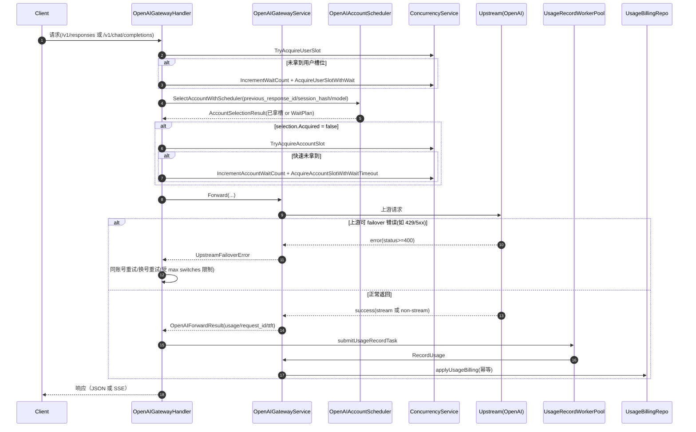

# sub2api 调度-并发-Failover-用量计费链路深挖（v2）

- 版本：v2.0
- 日期：2026-03-17
- 代码基线：`/home/long/project/立交桥/llm-gateway-competitors/sub2api-tar/backend`
- 目标：沉淀 S2 阶段可直接迁移到自研 Router Core 的主路径能力（特别是国内供应商 100% 接管场景）

## 1. 迁移状态确认（回答你的问题）

已确认开源项目库整体已迁入统一项目根：

- `立交桥/llm-gateway-competitors/sub2api-tar`
- `立交桥/llm-gateway-competitors/sub2api-src`
- `立交桥/llm-gateway-competitors/sub2api-full`
- `立交桥/llm-gateway-competitors/sub2api-code`
- `立交桥/llm-gateway-competitors/litellm`
- `立交桥/llm-gateway-competitors/one-api`
- `立交桥/llm-gateway-competitors/new-api`

结论：`subapi/sub2api`及其他对比仓库都已在`立交桥`目录下，可作为后续持续深读与集成源。

## 2. 本次深挖覆盖范围

核心入口与主链路文件：

1. 调度
- `internal/service/openai_account_scheduler.go`
- `internal/service/openai_gateway_service.go`

2. Handler 主流程（Responses / Chat Completions / Anthropic 兼容）
- `internal/handler/openai_gateway_handler.go`
- `internal/handler/openai_chat_completions.go`

3. 并发控制
- `internal/handler/gateway_helper.go`
- `internal/service/concurrency_service.go`

4. 异步用量任务池
- `internal/service/usage_record_worker_pool.go`

5. 计费幂等
- `internal/service/gateway_service.go`
- `internal/service/usage_billing.go`
- `internal/repository/usage_billing_repo.go`

6. 流式 failover 边界（对照）
- `internal/handler/gateway_handler.go`
- `internal/handler/failover_loop.go`
- `internal/handler/gateway_handler_stream_failover_test.go`

## 3. 端到端主链路（OpenAI Responses / Chat Completions）

## 4. 调度机制细节（SelectAccountWithScheduler）

`OpenAIGatewayService.SelectAccountWithScheduler`（`openai_account_scheduler.go`）是 3 层选择逻辑：

1. `previous_response_id` 粘性层（最高优先级）
- 入口：`Select()` 内先尝试 `SelectAccountByPreviousResponseID`
- 命中后 `decision.Layer=previous_response_id`
- 若有 `sessionHash`，会同步绑定 sticky session

2. `session_hash` 粘性层
- 读取 sticky account id
- 校验账号是否仍可调度、模型是否匹配、传输协议是否兼容
- 优先尝试直接抢账号槽位；失败则返回 WaitPlan（sticky 专用 timeout/max waiting）

3. 负载均衡层（load_balance）
- 过滤维度：排除集、可调度状态、模型支持、传输协议兼容
- 从并发服务批量拉取 `loadRate/waitingCount`
- 融合运行时统计（error_rate EWMA + TTFT EWMA）
- 评分项：`priority/load/queue/error_rate/ttft`
- 策略：先取 Top-K，再按权重随机顺序尝试抢槽，避免单账号长期垄断
- 若都抢不到，返回 fallback WaitPlan

评分来源（可调参数）在 `openAIWSSchedulerWeights()`，默认：

- Priority: 1.0
- Load: 1.0
- Queue: 0.7
- ErrorRate: 0.8
- TTFT: 0.5

## 5. 并发槽位模型（用户槽 + 账号槽）

### 5.1 获取顺序

在 `openai_gateway_handler.go` 中是明确的双层门控：

1. 先用户并发槽（防止单用户打爆）
2. 再账号并发槽（防止单账号过载）

### 5.2 快慢路径

`gateway_helper.go` 实现了统一并发辅助：

- 快路径：`TryAcquireUserSlot/TryAcquireAccountSlot`
- 慢路径：`Acquire*WithWait` + 指数退避 + 抖动
- 流式请求等待中会发 SSE ping（避免客户端超时）

### 5.3 等待队列上限控制

- 用户等待队列：`IncrementWaitCount`，上限=`CalculateMaxWait(userConcurrency)`
- 账号等待队列：`IncrementAccountWaitCount`，上限来自调度返回的 `WaitPlan.MaxWaiting`
- 队列满直接返回 429

### 5.4 槽位释放安全性

`wrapReleaseOnDone` 用 `context.AfterFunc + sync.Once` 保证：

- 正常完成会释放
- context 取消（客户端断开/超时）也会释放
- 多次释放只执行一次

这是并发槽不泄漏的关键机制。

## 6. Failover 机制与边界

## 6.1 触发条件

OpenAI 侧 failover 判定在 service 层：

- 显式状态码：`401/402/403/429/529` 与 `>=500`
- 以及 OpenAI 瞬态处理错误（内容解析）

满足时返回 `UpstreamFailoverError` 给 handler 进行重试/换号。

## 6.2 Handler 层重试策略

在 `openai_gateway_handler.go` / `openai_chat_completions.go`：

1. 若 `RetryableOnSameAccount=true` 且账号是 pool mode：
- 同账号短延迟重试（受 `pool retry limit` 限制）

2. 同账号重试耗尽：
- 计入失败账号集合，切换账号
- `switchCount` 超过 `maxAccountSwitches` 后 failover 结束

## 6.3 流式 no-replay 边界

对“已向客户端写出流式内容后是否还能 failover”的处理，代码体现为两种模式：

1. 通用 Gateway 路径（Anthropic/Gemini）有显式保护
- `gateway_handler.go` 记录 `writerSizeBeforeForward`
- 若 `UpstreamFailoverError` 返回时 `Writer.Size()` 已变化，判定“流已写出”，禁止继续 failover
- 测试 `gateway_handler_stream_failover_test.go` 明确验证“防止双 message_start 流拼接腐化”

2. OpenAI Responses/ChatCompat 路径
- failover 只在上游 `status>=400` 的响应阶段触发（此时尚未进入流转换写出）
- 进入 `handleStreamingResponse/handleChatStreamingResponse/handleAnthropicStreamingResponse` 后，发生的是流读写错误或超时，不再转成 `UpstreamFailoverError` 进行换号

推断（基于代码行为）：OpenAI 这条链路等价于“流开始后不做 replay failover”。

## 7. 异步用量记录：submitUsageRecordTask -> WorkerPool

`openai_gateway_handler.go` 在 Forward 成功后统一走：

- `requestPayloadHash := HashUsageRequestPayload(body)`
- `submitUsageRecordTask(func(ctx){ RecordUsage(...) })`

`usage_record_worker_pool.go` 关键点：

1. 有界队列 + worker 池
- 默认 `worker=128`，`queue=16384`

2. 队列满降级策略
- `drop`：直接丢
- `sync`：同步执行
- `sample`：按比例同步执行（默认 10%）其余丢弃

3. 自动扩缩容
- 扩容触发：队列占比超过上阈值
- 缩容触发：队列空且运行利用率低

4. 任务保护
- 每个任务有超时上下文
- panic recover

5. 兜底路径
- 如果 handler 未注入 worker 池，改为同步执行（避免无界 goroutine）

## 8. 计费与幂等：request_id + fingerprint

## 8.1 request_id 生成优先级

`resolveUsageBillingRequestID()` 的优先级：

1. `ctxkey.ClientRequestID` -> `client:<id>`
2. `ctxkey.RequestID` -> `local:<id>`
3. 上游 `result.RequestID`
4. `generated:<uuid>`

中间件来源：

- `ClientRequestID()`：注入 `ctx_client_request_id`
- `RequestLogger()`：读取/生成 `X-Request-ID` 并注入 `ctx_request_id`

## 8.2 payload fingerprint

`resolveUsageBillingPayloadFingerprint()`：

- 优先使用 `requestPayloadHash`（即 `HashUsageRequestPayload(payload)`）
- 其次回退到 client/local request id

目的：降低“同一个 request_id 被误复用”导致的静默误去重风险。

## 8.3 UsageBillingCommand 字段映射

| 来源 | 字段 | 说明 |
|---|---|---|
| `requestID` | `RequestID` | 幂等主键组成部分 |
| `APIKey.ID` | `APIKeyID` | 幂等主键组成部分 |
| `RequestPayloadHash` | `RequestPayloadHash` | 幂等冲突鉴别增强 |
| `UsageLog.Model` | `Model` | 计费维度 |
| `UsageLog.InputTokens` | `InputTokens` | 输入 token |
| `UsageLog.OutputTokens` | `OutputTokens` | 输出 token |
| `UsageLog.CacheCreationTokens` | `CacheCreationTokens` | cache create token |
| `UsageLog.CacheReadTokens` | `CacheReadTokens` | cache read token |
| `UsageLog.ImageCount` | `ImageCount` | 图像请求计费 |
| `Cost.ActualCost` | `BalanceCost` | 余额扣费 |
| `Cost.TotalCost` + 订阅 | `SubscriptionCost` | 订阅计费 |
| `Cost.ActualCost` + API Key quota | `APIKeyQuotaCost` | key 配额计费 |
| `Cost.ActualCost` + key ratelimit | `APIKeyRateLimitCost` | key 限速窗口用量 |
| `Cost.TotalCost*AccountRateMultiplier` | `AccountQuotaCost` | 账号配额计费 |

## 8.4 仓储层幂等执行（强一致）

`usage_billing_repo.go` 关键行为：

1. 事务内先 `claimUsageBillingKey`
- `INSERT usage_billing_dedup(request_id, api_key_id, request_fingerprint)`
- 冲突则读取已有 fingerprint 对比

2. 对比规则
- fingerprint 相同：视为重复请求，`Applied=false`（幂等成功，不重复扣费）
- fingerprint 不同：返回 `ErrUsageBillingRequestConflict`

3. claim 成功后执行扣费副作用
- 订阅累计
- 用户余额扣减
- API Key 配额/限速窗口
- 账号 quota（含 daily/weekly）

结论：这是“请求级 at-most-once 记账”语义，而非“至少一次”。

## 9. 失败模式与重试边界

| 阶段 | 错误类型 | 默认行为 | 是否自动重试 | 备注 |
|---|---|---|---|---|
| 用户槽获取 | 并发满/超时 | 429 | 否 | 可等待到超时 |
| 账号槽获取 | 并发满/超时 | 429 | 否 | 受 WaitPlan 限制 |
| 上游请求前 | 网络错误 | 502 | 否 | 非 failover 错误路径 |
| 上游 HTTP 错误 | failover 状态码 | 换号/同号重试 | 是 | 受 max switches/同号重试上限 |
| 流写出后错误（通用网关） | UpstreamFailoverError | 终止 failover | 否 | 防止流拼接腐化 |
| 流处理中断（OpenAI） | scan/read/timeout | 返回已采集 usage + 错误 | 否 | 不 replay failover |
| 用量任务池满 | 队列溢出 | drop/sample/sync | 视策略 | 可观测 dropped 指标 |
| 计费重复请求 | dedup 命中 | Applied=false | N/A | 不重复扣费 |
| 计费冲突 | 同 request_id 不同指纹 | 错误 | 否 | 需上层治理 request_id 生成 |

## 10. 对自研 Router Core 的直接启发（S2 主路径）

结合你的目标（S2 结束 >=60% 主路径接管，国内供应商 100%）：

1. 必须先自研的“不可外包”能力
- 并发双槽模型（user/account）+ wait queue 上限
- 幂等计费仓储（request_id + fingerprint）
- 流式 no-replay 边界控制（防流拼接）

2. 可先复用 subapi、后续替换的能力
- 账号调度具体打分权重
- 多协议转换细节（Responses/Chat/Messages）

3. 国内供应商 100% 接管建议
- 在 Router Core 里先实现国内供应商专属 scheduler + billing pipeline
- subapi connector 仅保留海外通道与过渡流量

4. 核心指标（建议纳入 S2 验收）
- 调度层命中率：`previous_response/session/load_balance`
- failover 成功率与平均切换次数
- 并发等待队列溢出率
- usage task dropped/sync fallback 比例
- billing conflict rate（request_id 冲突）

## 11. 后续 v3 建议

1. 深挖 `gateway_service.go` 的 Anthropic/Gemini 混合调度与模型路由规则优先级
2. 逐项抽取可复用测试用例为 Router Core 契约测试
3. 建立“流式写出后 failover 禁止”跨协议统一中间件（避免行为分叉）
